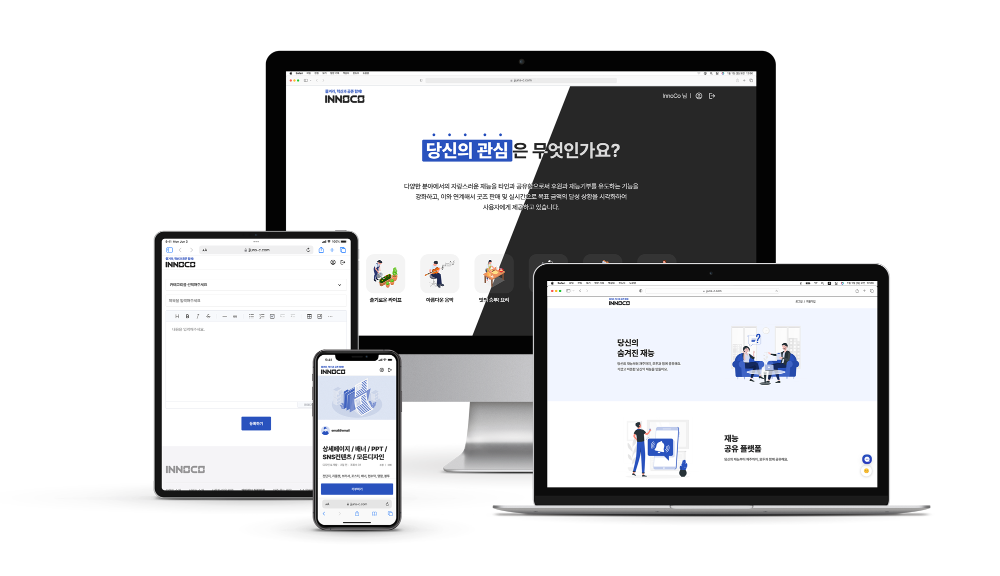

# 🔎 당신의 관심은 무엇인가요?
    

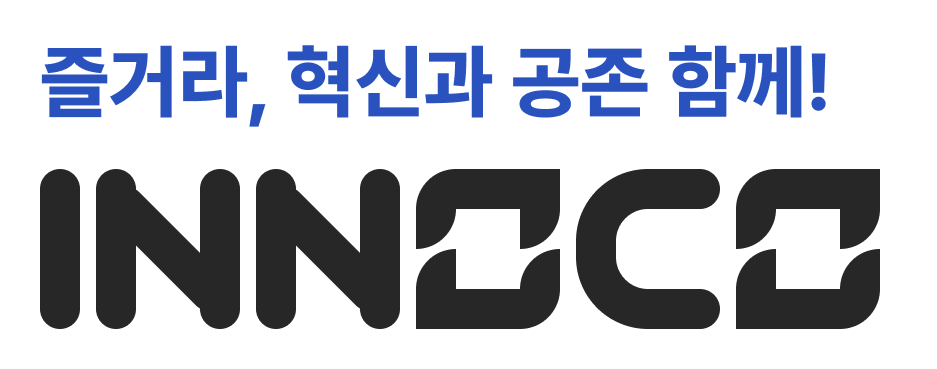

### InnoCo (Inno-Co): 이노코
- Innovation + Coexist의 합성어
- **혁신적인 아이디어**와 **다양한 분야의 사람**들이 공존하고 협력하여, **사회적 문제를 해결하는 플랫폼**

 

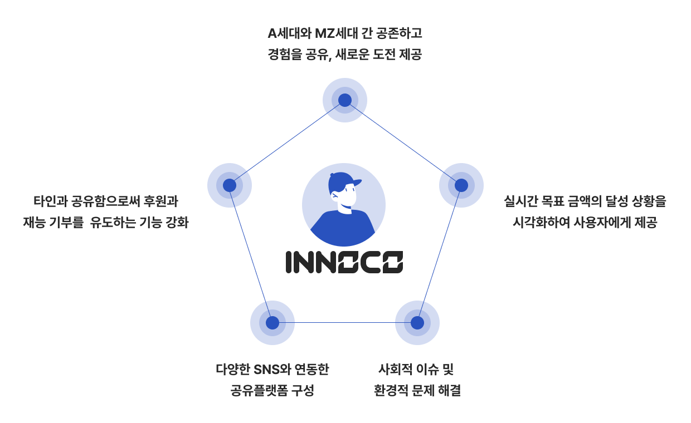

 

# 🗂 프로젝트 개요
### ✔️ 서비스 정의

1. 2020년대 트랜드 중 하나인 MZ, A세대 등 새로 출현된 세대와 함께 자신의 특기와 재능을 타인과 함께 공유하고, 후원을 받아 개인의 성장을 도모하는 플랫폼을 제공합니다. 이를 통해 **개개인뿐만 아니라 모두 구성원과 함께 지속적인 성장을 이루도록 도움을 지원**합니다.

2. 이 서비스는 다양한 분야에서의 자랑스러운 재능을 **타인과 공유함으로써 후원과 재능기부를 유도하는 기능을 강화**하고, 이와 연계해서 굿즈 판매 및 실시간으로 **목표 금액의 달성 상황을 시각화**하여 사용자에게 제공합니다.

3. 다양한 SNS과 연동한 공유플랫폼을 구성하여 A세대와 MZ세대 간 공존하고 경험을 공유하며 다양한 새로운 도전을 제공합니다. 이 또한 모든 구성원간 함께 힘을 모아 **사회적 이슈 및 환경적 문제를 해결** 할 수 있도록 지원합니다.

 

### ✔️ 주요 개발 기능 및 목표

1. **웹표준 및 접근성 준수**

    > 웹의 기본 원칙을 준수하고 웹표준 및 웹접근성 가이드라인을 따릅니다.  뿐만 아니라 모든 사용자가 웹사이트에 접근하고 사용할 수 있는 접근성을 제공합니다.
    
2. **차별없는 평등한 접근성 제공**
    
    > 반응형 웹사이트를 제작하여 모든 디바이스 환경에서 사용자들이 편리하게 접근할 수 있도록 합니다.  이로써 모든 사용자에게 평등한 접근성을 제공할 수 있도록 합니다. 
    
3. **유익하고 다양한 정보 제공**
    
    > 사용자들이 원하는 정보를 쉽게 검색하고 접근할 수 있도록 다양한 정보를 제공합니다.  콘텐츠를 카테고리화하고, 검색 기능과 필터링 기능을 제공하여 사용자들이 원하는 정보를 쉽게 찾을 수 있도록 합니다.
    
4. **회원 유형에 따른 맞춤서비스 제공**
    
    > 회원의 유형에 따라 맞춤형 서비스 경험을 제공합니다.  각 회원의 요구와 선호에 맞는 맞춤 서비스를 제공하여 사용자들이 개인화된 경험을 할 수 있도록 합니다.
    
5. **재능 공유 및 멘토링 기능**
    
    > MZ세대와 A세대 구성원들이 자신의 재능을 공유하고 멘토링을 제공할 수 있는 기능을 제공합니다.  사용자들은 자신의 재능을 등록하고, 다른 사용자들과 상호작용하며 지식과 경험을 공유할 수 있습니다.
    
6. **후원 및 기부 시스템**
    
    > 사용자들이 후원과 기부를 할 수 있는 시스템을 구축하여 지속적인 성장과 사회적 가치 창출을 도모합니다.
    
7. **사회적 이슈 공론화 및 문제 해결 기능**
    
    > 사용자들이 사회적 이슈에 대해 의견을 공유하고 문제 해결 방안을 모색할 수 있는 기능을 제공합니다.  사용자들은 토론 게시판에 참여하고 의견을 나눌 수 있으며, 협력하여 사회적 문제에 대한 해결 방법을 찾습니다.
    
8. **진행 상황과 목표 달성 확인 기능**
    
    > 프로젝트의 진행 상황과 목표 달성 상황을 실시간으로 확인할 수 있는 기능을 제공하여 사용자들의 참여 동기를 부여합니다.  또한, 프로젝트 참여자들끼리 소통하고 협력할 수 있는 공간을 제공합니다.

 

### ✔️ 프로젝트 기간
- 2023.07.03 ~ 2023.08.11 (6주)

    유형 | 일정 | 유형 | 일정 
    :----------: | :----------: | :----------: | :----------: 
    `주제 및 개발환경` | 23.07.03 ~ 23.07.07 |   `프론트엔드 기능 구현` | 23.07.12 ~ 23.08.02
    `UI 설계` | 23.07.05 ~ 23.07.10 |   `백엔드 기능 구현` | 23.07.12 ~ 23.08.02
    `프로덕트 스펙 작성` | 23.07.08 ~ 23.07.10 |   `DB 설계` | 23.07.21 ~ 23.07.28
    `와이어프레임 제작` | 23.07.09 ~ 23.07.10 |   `테스트 및 버그 수정` | 23.08.03 ~ 23.07.08
    `유형별 기능연구` | 23.07.06 ~ 23.07.15 |   `발표 준비` | 23.08.09 ~ 23.08.11
    ### 📝 [프로젝트 발표 자료](https://www.figma.com/proto/uHFav5Gp9qkY3kHZ2kElLi/%EC%B5%9C%EC%A2%85%ED%94%84%EB%A1%9C%EC%A0%9D%ED%8A%B8_%EB%82%B4-%EA%B4%80%EC%8B%AC%EC%9D%84-%ED%8C%9D%EB%8B%88%EB%8B%A4(%EB%B7%B0%EC%96%B4%EC%9A%A9)?page-id=0%3A1&type=design&node-id=121-6984&viewport=482%2C154%2C0.02&t=KPZI6LJYRowasxkq-1&scaling=contain&mode=design)

 

# ⚙️ 개발환경

### ✔️ OS
 

### ✔️ 개발 프로그램
 

### ✔️ Frond-end
     

- axios: 1.4.0
- sass: 1.63.6
- typescript: 4.9.5
- npm: 9.6.7
- node: 18.17.0
- react: 18.2.0

### ✔️ BackEnd
 

- Type: Gradle(Groovy)
- Packaging: Jar
- Java Version: 11
- Spring Version: 2.7.13

### ✔️ DB
 

- MariaDB: 10.11.3 (내부 테스트용)
- MySQL: 8.0

### ✔️ 협업툴
  

 

# 🖥 주요 기능 소개
### ✔️ 메인홈
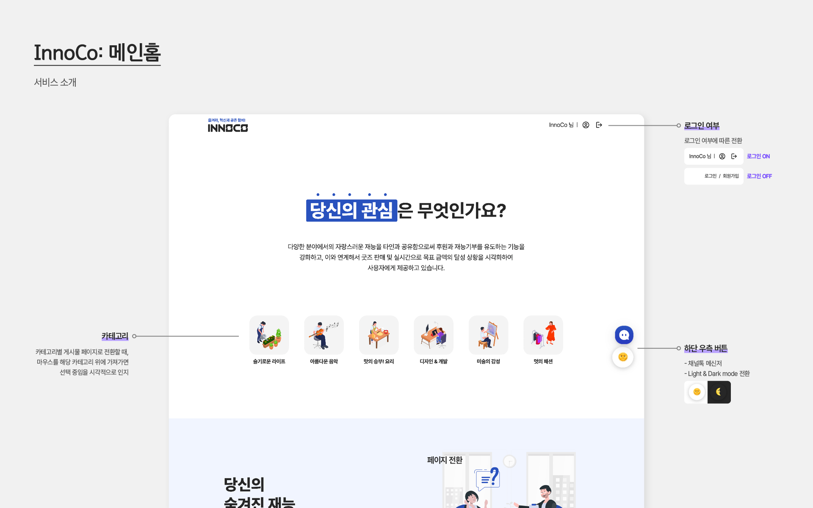

 

---

### ✔️ 회원관련
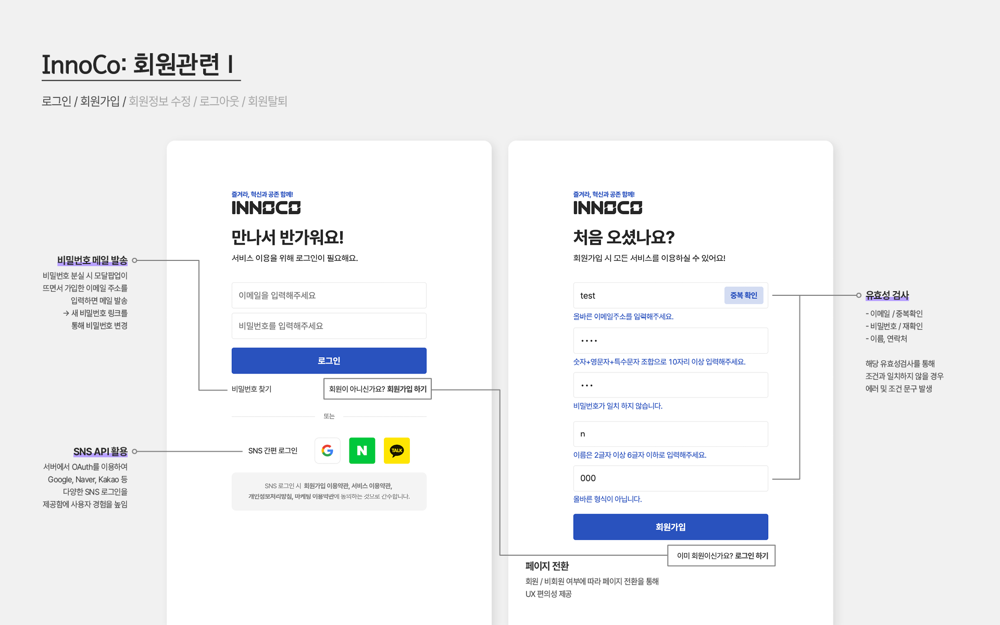 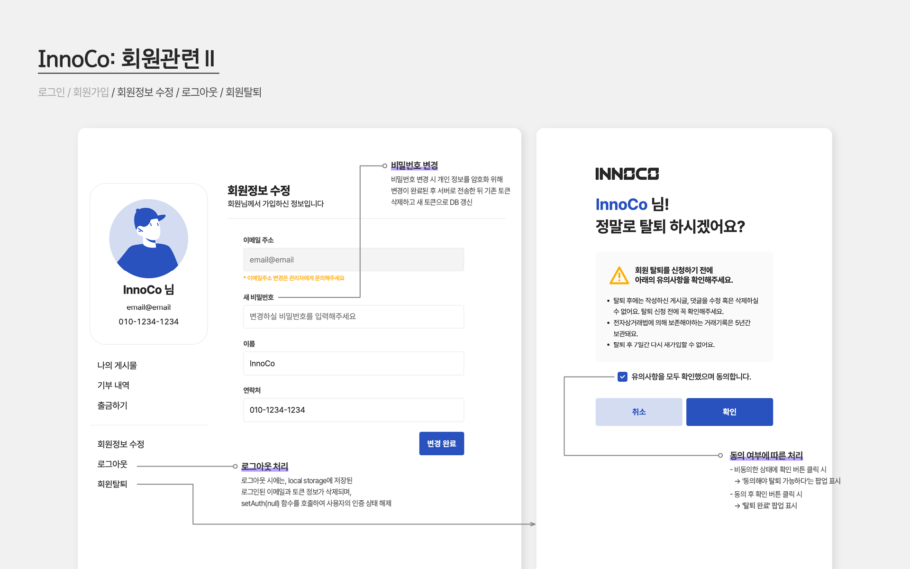

#### 이메일: @, . 입력가능
> [숫자+영문자 조합][@][숫자+영문자 조합][.][영문자 2~3자]
#### 비밀번호: 숫자+영문자+특수문자 조합 10자 이상 비밀번호 재확인
> [문자열 조합 10자 이상]
#### 이름:  2 ~ 6글자까지
> [문자열 길이 2~6자]
#### 연락처: 숫자만 입력 가능
> [숫자: 010][-][숫자 4자][-][숫자 4자] or [숫자:010][숫자4자][숫자 4자]  
    
 

---

### ✔️ 게시물관련
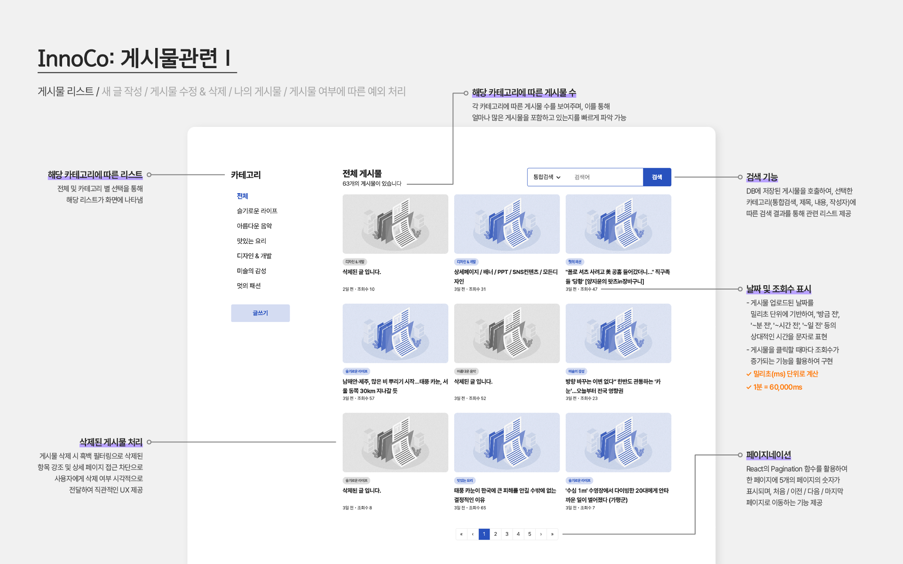 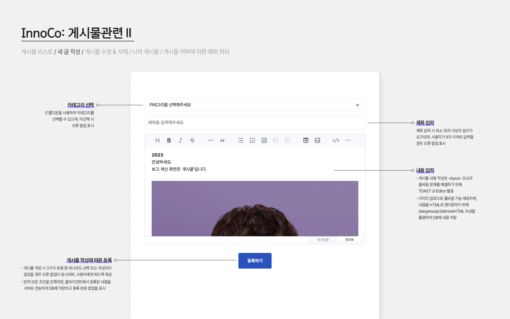 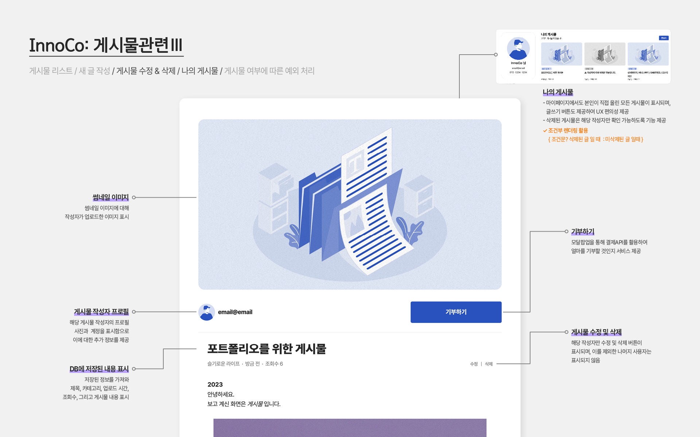 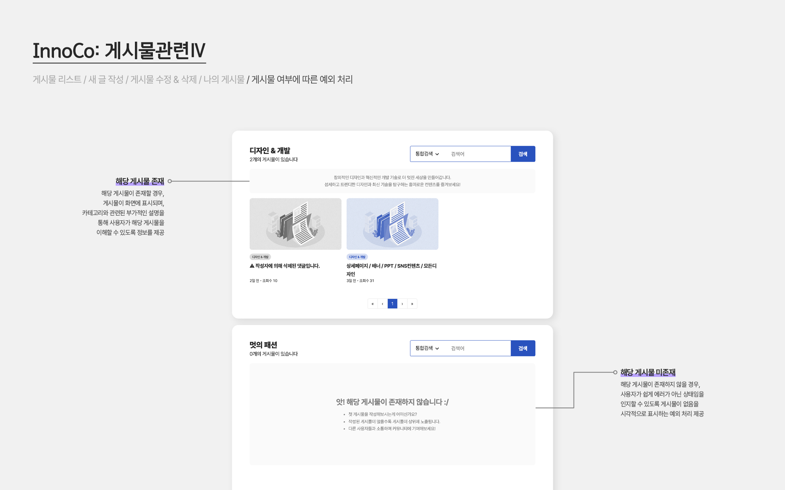

 

---

### ✔️ 댓글관련
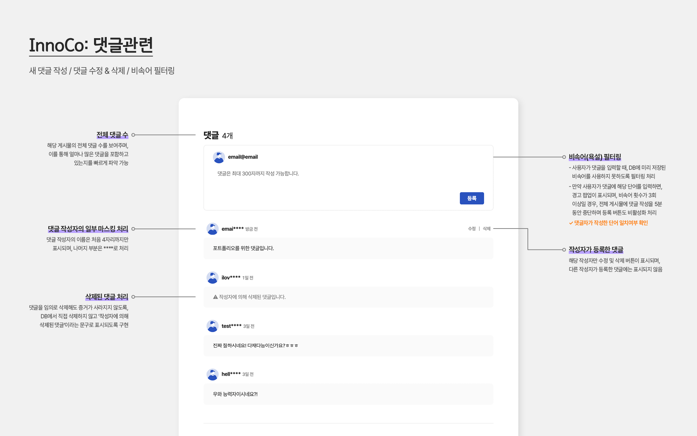

 

# 📋 주요 참고사례
### 기획
- MZ세대
    - MZ세대를 사로잡는 서비스기획
    - MZ세대가 관심 있는 사회 이슈는 복지·재난·기후변화 순
- A세대
    - 실버가 아닌 A세대, 새로운 소비 주역이 되다
    - 춤 출때 힘을 적당히줘야하는 이유..

### UX/UI디자인
- [Notion] JJUN Creative - UX/UI design
- [Notion] JJUN Creative - Platform design
- JJUN Design Library
### WEB 디자인/개발
- 텀블벅 - 크리에이터를 위한 크라우드펀딩
- 와디즈
- 라이프스타일 슈퍼앱, 오늘의집
- 당신 근처의 당근마켓
- 중고나라, 우리나라 최대 중고거래 플랫폼
- 밀리의 서재

 

# 🙋🏻 구성원
<table>
  <tbody>
    <tr>
      <td align="center"><a href="https://github.com/jjun-panda">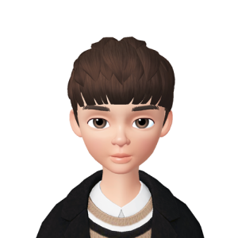 <b>팀장 최준석</b></a> 프로젝트 총괄</td>
      <td align="center"><a href="https://github.com/AubeePin"> <b>팀원 서민경</b></a> 기획 & 개발 보조</td>
      <td align="center"><a href="https://github.com/seohyeongwon">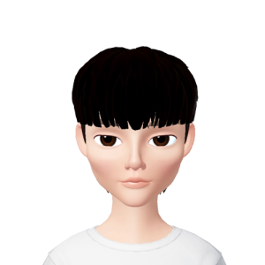 <b>팀원 서형원</b></a> 게시판 담당</td>
      <td align="center"><a href="https://github.com/limmyungcheol">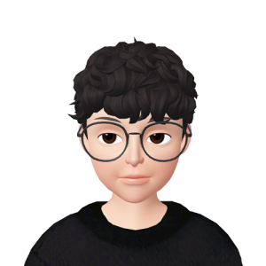 <b>팀원 임명철</b></a> 회원 관리 담당</td>
      <td align="center"><a href="https://github.com/BlackPink357">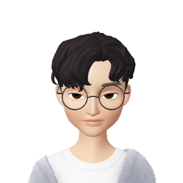 <b>팀원 최승현</b></a> 로그인 담당</td>
  </tbody>
</table>

<!-- |  |  |  |  |  |
| :------------------------------------------------------: | :-----------------------------------------------------: | :---------------------------------------------------: | :-------------------------------------------------------: | :--------------------------------------------------------: |
|          [최준석](https://github.com/jjun-panda)           |          [서민경](https://github.com/AubeePin)           |          [서형원](https://github.com/seohyeongwon)           |          [임명철](https://github.com/limmyungcheol)           |          [최승현](https://github.com/BlackPink357)           |
| <strong>팀장</strong> 프로젝트 총괄 | <strong>팀원</strong> 기획 & 개발 보조 | <strong>팀원</strong> 게시판 담당 | <strong>팀원</strong> 회원 관리 담당 | <strong>팀원</strong> 로그인 담당 | -->